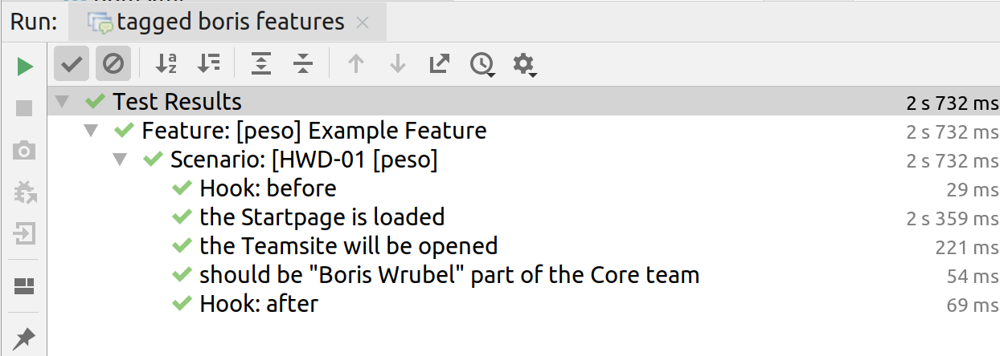

# kotlin-cucumber-selenium-skeleton

This is a skeleton which is based on selenium, cucumber with kotlin, and parallel-execution support with cucable.
Also cucumber-picocontainer are added for a smoothly usage of test data in all steps.

# How to run tests locally

You need to define some parameters to get the tests run as you expected

Example runtime parameters:

    -Dbrowser=chrome
    -Dbrowser.version=74.0
    -DbaseUrl="http://peso.inso.tuwien.ac.at"
    -Ddriver.version=74
    
## screen

If you have a multiple monitor system and want to have the browser window on a dedicated screen just use the screen parameter: 
      
      -Dscreen=:0.0

Depending on your os the iDstring is different for your screens. GraphicsEnvironment Package is used. Use -DprintScreens=yes to get a list in log for next execution

# Run tests with a grid or selenoid

    -Dselenium.grid=http://<ip-of-your-grid:4444>

# scenarios
## feature file structure
To find scenarios faster (especially if the fail) I used a template for scenarios:

    Feature: [peso] Example Feature

      Background:
        Given the Startpage is loaded

      Scenario: [HWD-01 [peso]
        Then the peso-logo should be displayed
      
      
[peso] means that peso is the filename, this makes it much easier to find steps if the IntelliJ-Runner or the jenkins-cucumber-reporter mark a scenario and/or a step if they are failing

scenarios have a unique ID. The ID is not checked anywhere, it is selforganzing, again if a scenario fails you can easily jump to the step definitions via text search in your IDE.

//TODO add here screenshots from jenkins and IntelliJ Runner

