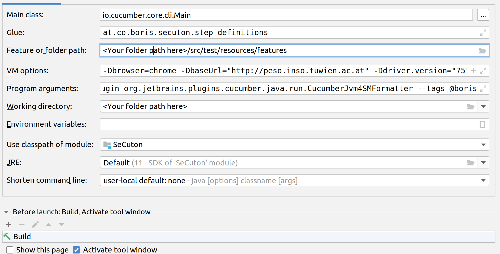

# SeCuton - Selenium Cucumber Skeleton

If you want to start as fast as possible with [Selenium](https://github.com/SeleniumHQ/selenium) in combiation with [cucumber](https://github.com/cucumber/cucumber) your are absolutely right here. Just checkout this repo and start it. It provides running examples so that everybody can create new test in a short time.

You should be familar with kotlin (or Java) and cucumber to create new scenarios and corresponding glue code.

This is a skeleton which is based on selenium, cucumber with kotlin, and parallel-execution support with cucable.
Also [cucumber-picocontainer](https://github.com/cucumber/cucumber-jvm/tree/master/picocontainer) are added for a smoothly usage of test data between all steps.
For quick and easy setup of Webdriver, [WebDriverManager](https://github.com/bonigarcia/webdrivermanager) from [Boni Garica](https://github.com/bonigarcia/bonigarcia.github.io) is used. 

Reports will be generated with [cluecumber Report](https://github.com/trivago/cluecumber-report-plugin) or if you run the test in a jenkins environment [Cucumber Report](https://wiki.jenkins.io/display/JENKINS/Cucumber+Reports+Plugin) can be used for smooth reports

## Prerequireies
* Java SDK (tested with Version 11 and 12)
* Maven

### Optional:
* Selenium Grid / [Selenoid](https://github.com/aerokube/selenoid) / Moon if you don't want to run the test locally
* [Appium](https://github.com/appium/appium) for Android test execution 

# How to run tests locally

* Option 1: Start with maven

     `clean install -DbaseUrl=http://peso.inso.tuwien.ac.at -f pom.xml` 

* Option 2: Start directly from IDEA with a runConfiguration

In both cases you need to define some parameters to get the tests run:

| Name | Description |
|------|-------------|
|browser | choose the type of the browser, allowed values are defined in [DriverTypes Class](/src/DriverTypes.kt) |
| browser.version | if you do not want to use the newest browser version which will be provided by the webdriver manager you can set the version with this parameter|
| driver.version | sometimes it is necessary to the version for the WebDriver, depending on which browser.version you are using, or you have installed on your local machine, for browser.version and driver.version take a look at webdriver manager (LINK)|
| baseUrl | the base URL for your website under test |  

Example runtime parameters:

    -Dbrowser=chrome
    -Dbrowser.version=74.0
    -DbaseUrl="http://peso.inso.tuwien.ac.at"
    -Ddriver.version=74
    
browser see +sectrion browser-types

    
## screen

If you have a multiple monitor system and want to have the browser window on a dedicated screen just use the screen parameter: 
      
      -Dscreen=:0.0

Depending on your os the iDstring is different for your screens. GraphicsEnvironment Package is used. Use -DprintScreens=yes to get a list in log for next execution

# Run tests with a selenium grid, selenoid or appium

    -Dselenium.grid=http://<ip-of-your-grid:4444>

# Scenarios
## Feature file structure
For finding scenarios faster (especially if the fail) I used a template for scenarios with two components
* Filename is given in []
* Description of every scenario starts with [XXX-99 followed again with the [filename]

example:

    Feature: [peso] Example Feature

      Background:
        Given the Startpage is loaded

      Scenario: [HWD-01 [peso]
        Then the peso-logo should be displayed
      
      
[peso] means that peso is the filename, this makes it much easier to find steps if the IntelliJ-Runner or the jenkins-cucumber-reporter mark a scenario and/or a step if they are failing

scenarios have a unique ID. The ID is not checked anywhere, it is selforganzing, again if a scenario fails you can easily jump to the step definitions via text search in your IDE.

//TODO add here screenshots from jenkins

#Supported Browser
Setup will be done via webDriverManger as mentioned above.

## chrome
chrome or chromium which is supported by chromedriver. 
## firefox

## mobile-chrome emulation (with user-agent manipulation)
This will use the experimental feature 
 `chromeOptions.setExperimentalOption("mobileEmulation", mobileEmulation);`

chrome is used with a manipluated user-agnet, similar to mobile view in browser developer mode

## mobile-chrome (via selenoid)
This only works if you have a selenoid or moon environment. Further information will follow.

example runtime configuration for an emulated Pixel 2 with a desktop chrome browser:

    -Dbrowser=chrome_mobile_emulation
    -Dbrowser.version=75.0
    -Ddriver.version=75
    -DbaseUrl="http://peso.inso.tuwien.ac.at"
    -DprintScreens=yes
    -Demulated.device="Pixel 2"
## Android device (via appium)
You can use a emulated device (avd-manager) or an connected real Device which is supported by appium.

    boris@xps13:~/Android/Sdk/platform-tools$ ./adb devices
    List of devices attached
    emulator-5554	device

Use Parameter to set the id `-Ddevice.id="emulator-5554"`

example runtime configuration for an emulated 8.1 Android device:

        -Dbrowser=android_device
        -DbaseUrl="http://peso.inso.tuwien.ac.at"
        -Dselenium.grid=http://localhost:4723
        -Ddriver.version=2.34
        -Ddevice.id="emulator-5554"

